# 🔐 Authentication Architecture & Implementation Guide

This guide details the complete modular authentication architecture of the Node.js TypeScript MVC Backend, explaining how Joi DTO schemas, custom Express middlewares, security hooks, and JWTs interact to form a secure, production-grade session layer.

---

## 🗺️ Request-Response Authentication Lifecycle

The sequence below illustrates the lifecycle of a request entering the system, passing through validation, guards, controllers, service layers, and database hooks before returning a unified success payload.

```mermaid
sequenceDiagram
    autonumber
    actor Client
    participant Express as Express Router
    participant DTO as Joi Validation Guard
    participant AuthGuard as Protect Guard
    participant Controller as Auth Controller
    participant Service as Auth Service
    participant DB as MongoDB (Mongoose Schema)
    participant Response as Success Interceptor

    Client->>Express: POST /api/v1/auth/login (Payload)
    
    rect rgb(240, 248, 255)
        note right of DTO: 🛡️ Input Integrity Phase
        Express->>DTO: validate(loginDto)
        alt invalid input structure
            DTO-->>Client: 400 Bad Request ("email must be a valid email")
        else valid input structure
            DTO->>Express: Next() & Sanitized req.body
        end
    end

    rect rgb(255, 240, 245)
        note right of AuthGuard: 🔏 Session Verification Phase (For Protected Routes)
        Express->>AuthGuard: protect (Bearer JWT check)
        alt token missing/expired
            AuthGuard-->>Client: 401 Unauthorized ("Token expired")
        else token active
            AuthGuard->>Express: req.user = decodedToken & Next()
        end
    end

    Express->>Controller: login(req, res, next)
    Controller->>Service: loginUser(email, password)
    
    rect rgb(240, 255, 240)
        note right of DB: 💾 Database Hooks Phase
        Service->>DB: Find user by email
        DB-->>Service: User Record (Hashed Password)
        Service->>DB: Compare passwords (bcrypt.compare)
        
        alt password match failed
            Service-->>Controller: Throw AppError(401)
        else password valid
            Service->>Service: Generate JWT (Access & Refresh)
            Service->>DB: Save Refresh Token
            Service-->>Controller: User Data & Generated Tokens
        end
    end

    Controller->>Response: sendSuccess(res, Status, Tokens, Cookies)
    Response-->>Client: 200 OK (Clean JSON + Secure HTTP-Only Cookies)
```



---

## 🛡️ 1. Input Validation with Joi & DTOs

The system strictly decouples route definitions from data schema integrity using **Data Transfer Objects (DTOs)** backed by **Joi**.

### 📝 The DTO Declarations
DTOs are housed inside the functional modules (e.g. `src/app/modules/auth/dto/`).
- **`register.dto.ts`**: Validates user inputs during registration. Requires a name (min 2, max 50 characters), email (validated format), and a strong password (enforcing a password strength regex: minimum 8 characters, at least 1 uppercase, 1 lowercase, 1 number, and 1 special character).
- **`login.dto.ts`**: Ensures the request body contains a valid email and a non-empty password before hitting the controller.

### ⚙️ The `validate` Middleware
Located in [`src/app/common/guards/validate.middleware.ts`](file:///home/sourav16541/Desktop/Projects/Sourav/servers/MVC_Backend_Practice/src/app/common/guards/validate.middleware.ts), this generic middleware accepts a Joi schema:

```typescript
export const validate = (schema: Joi.ObjectSchema) => {
  return (req: Request, _res: Response, next: NextFunction): void => {
    const { error, value } = schema.validate(req.body, {
      abortEarly: false,   // reports ALL parsing errors, not just the first one
      stripUnknown: true,  // silently drops any non-declared query parameters
    });

    if (error) {
      const message = error.details.map((d) => d.message.replace(/"/g, '')).join(', ');
      throw new AppError(message, HTTP_STATUS.BAD_REQUEST);
    }

    req.body = value;      // uses the clean, parsed, and type-cast payload
    next();
  };
};
```

#### Key Advantages:
1. **Zero Pollution**: `stripUnknown: true` filters out potentially malicious fields sent by the client.
2. **Type Casting**: Joi automatically casts numeric strings and formats to their true types.

---

## 🔒 2. Express Security & Route Guards

### 🛡️ The `protect` Middleware
The session lock middleware (`protect`) ensures a request possesses a valid session. It:
1. Checks the `Authorization` header for `Bearer <JWT>`.
2. Fallback-checks HTTP-Only cookies for the `accessToken` token.
3. Decodes the token using the secret JWT key.
4. Augments the standard Express `Request` object with the user session: `req.user = decodedPayload`.

### 👥 The `restrictTo` Middleware
Role-based authorization is enforced downstream of the session check:

```typescript
export const restrictTo = (...roles: string[]) => {
  return (req: Request, _res: Response, next: NextFunction): void => {
    if (!req.user || !roles.includes(req.user.role)) {
      throw new AppError("Forbidden - access denied", HTTP_STATUS.FORBIDDEN);
    }
    next();
  };
};
```

---

## 🗄️ 3. Mongoose Cryptographic Hooks

User schema models handle secure credentials behind the scenes inside [`src/app/modules/users/schemas/users.schema.ts`](file:///home/sourav16541/Desktop/Projects/Sourav/servers/MVC_Backend_Practice/src/app/modules/users/schemas/users.schema.ts) using **`bcryptjs`**:

```typescript
// Hash password automatically before writing
UserSchema.pre<IUser>('save', async function () {
  if (!this.isModified('password')) return;
  const salt = await bcrypt.genSalt(12); // cost factor 12 — state-of-the-art security
  this.password = await bcrypt.hash(this.password, salt);
});

// Compare request password with hashed Mongoose record
UserSchema.methods.comparePassword = async function (password: string): Promise<boolean> {
  return bcrypt.compare(password, this.password);
};
```

#### Key Strengths:
- **Decoupled Hashing**: Password hashing happens automatically inside the model layer. Services don't need to manually invoke hash functions.
- **Safe Comparison**: By using `bcrypt.compare`, the app is secure against database-level side-channel attacks and timing attacks.
